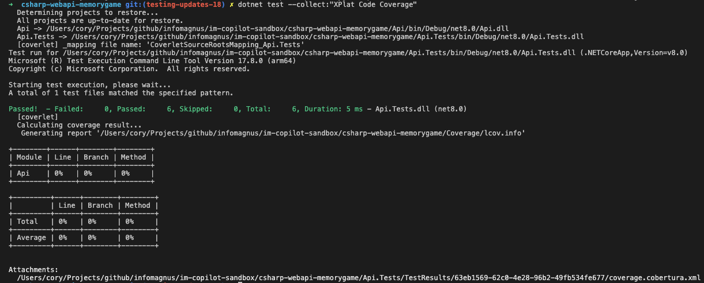

### Description

This lab will focus on testing code with Copilot. The testing framework has already been created in the `/tests/` directory.

### Steps
#### 1. Ask Copilot how to test the Routes.cs file.
```text
How do I write test cases for #file:Routes.cs?
```

<details>
<summary>Output</summary>
<p>

GitHub Copilot: To write test cases for [`Routes.cs`](command:_github.copilot.openRelativePath?%5B%7B%22scheme%22%3A%22file%22%2C%22authority%22%3A%22%22%2C%22path%22%3A%22%2FUsers%2Fcory%2FProjects%2Fgithub%2Finfomagnus%2Fim-copilot-sandbox%2Fcsharp-webapi-memorygame%2Fapi%2FRoutes%2FRoutes.cs%22%2C%22query%22%3A%22%22%2C%22fragment%22%3A%22%22%7D%5D "/Users/cory/Projects/github/infomagnus/im-copilot-sandbox/csharp-webapi-memorygame/api/Routes/Routes.cs"), follow these steps:

1. **Setup Test Environment**: Use a testing framework like xUnit for .NET.
2. **Mock Dependencies**: Mock the [`WebApplication`](command:_github.copilot.openSymbolFromReferences?%5B%7B%22%24mid%22%3A1%2C%22path%22%3A%22%2Fvar%2Ffolders%2F16%2F1p4hvhz51ql6z4yk5j7_v32c0000gn%2FT%2FMetadataAsSource%2F9e92525448324d94ba5a2d95b3ebfc40%2FDecompilationMetadataAsSourceFileProvider%2Fbfa922407a3a4f27af9389434f4645fa%2FWebApplication.cs%22%2C%22scheme%22%3A%22file%22%7D%2C%7B%22line%22%3A26%2C%22character%22%3A24%7D%5D "../../../../../../../var/folders/16/1p4hvhz51ql6z4yk5j7_v32c0000gn/T/MetadataAsSource/9e92525448324d94ba5a2d95b3ebfc40/DecompilationMetadataAsSourceFileProvider/bfa922407a3a4f27af9389434f4645fa/WebApplication.cs") and any services or data access layers used, such as [`GameData`](command:_github.copilot.openSymbolFromReferences?%5B%7B%22%24mid%22%3A1%2C%22path%22%3A%22%2FUsers%2Fcory%2FProjects%2Fgithub%2Finfomagnus%2Fim-copilot-sandbox%2Fcsharp-webapi-memorygame%2Fapi%2FServices%2FGameData.cs%22%2C%22scheme%22%3A%22file%22%7D%2C%7B%22line%22%3A5%2C%22character%22%3A17%7D%5D "api/Services/GameData.cs").
3. **Write Test Methods**: For each endpoint, write a test method that simulates a request and asserts the expected response.

### Pseudocode for Test Cases

```plaintext
1. Setup xUnit test project
2. Add Moq package for mocking dependencies
3. Create a class GameEndpointsTests

   For each endpoint in Routes.cs:
   
   a. Test "/greeting" GET Endpoint
      - Mock WebApplication
      - Call the endpoint
      - Assert the response is 200 OK and the content matches the greeting message

   b. Test "/game" POST Endpoint
      - Mock WebApplication and GameData service
      - Create a valid Game object and send it
      - Assert the response is 200 OK and the content indicates success
      - Repeat with invalid Game object and assert 400 Bad Request

   c. Test "/game/{handle}" GET Endpoint
      - Mock WebApplication and GameData service to return a Game object
      - Call the endpoint with a valid handle
      - Assert the response is 200 OK and the Game object is returned
      - Repeat with an invalid handle and assert 404 Not Found

   d. Test "/leaderboard" POST Endpoint
      - Mock WebApplication and GameData service
      - Create a valid Leaderboard entry and send it
      - Assert the response is 200 OK and the content indicates success
      - Repeat with invalid entry and assert 400 Bad Request

   e. Test "/leaderboard" GET Endpoint
      - Mock WebApplication and GameData service to return a list of Leaderboard entries
      - Call the endpoint
      - Assert the response is 200 OK and the top ten entries are returned
```

### Example Test Case for "/greeting" Endpoint

```csharp
using Xunit;
using Moq;
using Microsoft.AspNetCore.Http;
using Microsoft.AspNetCore.Builder;
using Microsoft.Extensions.DependencyInjection;
using api.Routes;
using System.Threading.Tasks;

public class GameEndpointsTests
{
    [Fact]
    public async Task GreetingEndpoint_ReturnsWelcomeMessage()
    {
        // Arrange
        var application = new WebApplicationMock();
        GameEndpoints.MapGameEndpoints(application.App);

        // Act
        var response = await application.Client.GetAsync("/greeting");

        // Assert
        response.EnsureSuccessStatusCode();
        var content = await response.Content.ReadAsStringAsync();
        Assert.Equal("Welcome to the Memory Game API!", content);
    }
}

// Mock setup for WebApplication, using TestServer or similar approach
```

This example demonstrates how to test the "/greeting" endpoint. You would need to create similar tests for the other endpoints, adjusting the setup and assertions according to what each endpoint does. Remember to mock [`GameData`](command:_github.copilot.openSymbolFromReferences?%5B%7B%22%24mid%22%3A1%2C%22path%22%3A%22%2FUsers%2Fcory%2FProjects%2Fgithub%2Finfomagnus%2Fim-copilot-sandbox%2Fcsharp-webapi-memorygame%2Fapi%2FServices%2FGameData.cs%22%2C%22scheme%22%3A%22file%22%7D%2C%7B%22line%22%3A5%2C%22character%22%3A17%7D%5D "api/Services/GameData.cs") and any other dependencies to isolate the tests from external factors.
</p>
</details>

#### 2. Ask Copilot How to Install xUnit

```text
How can I configure xUnit in Visual Studio Code for running the tests?
```

`NOTE` that the packages for testing have already been installed for this lab.

<details>
<summary>Output</summary>
<p>
GitHub Copilot: To install xUnit in your .NET project, follow these steps using the .NET CLI:

1. Open your terminal.
2. Navigate to your project directory.
3. Run the following command to install the xUnit package:

```shell
dotnet add package xunit --version 2.8.1
```

4. To add the xUnit runner, which is necessary to run your tests, execute:

```shell
dotnet add package xunit.runner.visualstudio --version 2.8.1
```

5. Optionally, if you want to use the `[Theory]` and `[InlineData]` attributes for parameterized tests, you might also want to install the `xunit.extensions` package:

```shell
dotnet add package xunit.extensions --version 2.8.1
```

After running these commands, your project will have xUnit installed, and you can start writing your tests.
</p>
</details>

#### 3. Ask Copilot How to configure xUnit in VSCode

```text
How can I configure xUnit in Visual Studio Code for running the tests?
```

<details>
<summary>Output</summary>
<p>
To configure xUnit in Visual Studio Code for running tests, follow these steps:

1. **Install .NET Core SDK**: Ensure you have the .NET Core SDK installed on your machine. You can download it from the official .NET website.

2. **Install C# Extension for VS Code**: If not already installed, install the C# extension by Microsoft from the Visual Studio Code Marketplace. This extension provides support for .NET Core development, including running and debugging tests.

3. **Create or Update the Test Project**:
   - If you haven't already, create a test project in your solution. You can do this by running the following command in the terminal:
     ```shell
     dotnet new xunit -n YourTestProjectName
     ```
   - Add a reference to the project you want to test:
     ```shell
     dotnet add YourTestProjectName reference Path/To/Your/Project
     ```

4. **Install xUnit and xUnit Runner**:
   - Ensure your test project has the necessary xUnit and test runner packages. You can add them using the following commands:
     ```shell
     dotnet add package xunit
     dotnet add package xunit.runner.visualstudio
     ```
   - Also, for .NET Core 3.1 or later, adding the `Microsoft.NET.Test.Sdk` package is recommended:
     ```shell
     dotnet add package Microsoft.NET.Test.Sdk
     ```

5. **Configure `launch.json` for Debugging**:
   - Open the Run and Debug view in VS Code (`View` > `Run` or `Ctrl+Shift+D`).
   - Create a `launch.json` file by clicking on create a launch.json file link.
   - Select `.NET Core`.
   - This automatically creates a configuration for running and debugging applications. Ensure there's a configuration for your test project.

6. **Running Tests**:
   - **Using the Terminal**: You can run your tests by executing the following command in the terminal:
     ```shell
     dotnet test
     ```
   - **Using Test Explorer UI**: For a GUI approach, you can install the `Test Explorer UI` extension along with the `.NET Core Test Explorer` extension from the VS Code Marketplace. These extensions provide a graphical interface for running and debugging tests.

7. **Optional Settings**:
   - You can configure test settings in your `.csproj` file or through a `runsettings` file for more advanced scenarios like code coverage.

By following these steps, you should be able to run and debug xUnit tests in Visual Studio Code.
</p>
</details>

#### 4. Run Tests and Check Code Coverage

- Open the VS Code terminal and enter:
    ```sh
    dotnet test --collect:"XPlat Code Coverage"
    ```
    You should see something similar to this.

    
  
#### 5. Generate Test for the Greeting Endpoint

- Open the `Api.Tests/RouteTests.cs` file.
- Highlight the `GreetingEndpoint_RerurnsWelcome` function
- Ask Copilot to generate the test case
    ```text
    #selection
    ```

    <details>
    <summary>Output</summary>
    <p>

    ```csharp
    using System.Net;
    using System.Net.Http;
    using System.Threading.Tasks;
    using Microsoft.AspNetCore.Mvc.Testing;
    using Xunit;

    namespace Api.Tests
    {
        public class GameEndpointsTests : IClassFixture<WebApplicationFactory<Api.Startup>>
        {
            private readonly WebApplicationFactory<Api.Startup> _factory;

            public GameEndpointsTests(WebApplicationFactory<Api.Startup> factory)
            {
                _factory = factory;
            }

            [Fact]
            public async Task Get_Greeting_ReturnsWelcomeMessage()
            {
                // Arrange
                var client = _factory.CreateClient();

                // Act
                var response = await client.GetAsync("/greeting");
                response.EnsureSuccessStatusCode();
                var responseString = await response.Content.ReadAsStringAsync();

                // Assert
                Assert.Equal(HttpStatusCode.OK, response.StatusCode);
                Assert.Contains("Welcome to the Memory Game API!", responseString);
            }

            // Additional tests for other endpoints can follow a similar structure
        }
    }
    ```

</p>
</details>

#### 5. Generate Test Data

Copilot can generate some sample data to test against.

- Let's try generating a game for the "testhandle" user. Enter the following in the chat textbox.

    ```text
    Generate a sample game data file in the Data directory for handle "testHandle" using #file:Game.cs and #file:Card.cs as references. There should be 8 cards (4 pairs) and CardType is a random color. Randomize the card order. Pick two of them to be in the flipped state.
    ```

    <details>
    <summary>Output</summary>
    <p>

    ```json
    {
    "Handle": "testHandle",
    "TurnsTaken": 5,
    "TimeTaken": 300,
    "GameCompleted": false,
    "Cards": [
        {
        "CardType": "red",
        "State": "hidden"
        },
        {
        "CardType": "blue",
        "State": "flipped"
        },
        {
        "CardType": "green",
        "State": "hidden"
        },
        {
        "CardType": "yellow",
        "State": "hidden"
        },
        {
        "CardType": "blue",
        "State": "hidden"
        },
        {
        "CardType": "red",
        "State": "flipped"
        },
        {
        "CardType": "yellow",
        "State": "hidden"
        },
        {
        "CardType": "green",
        "State": "hidden"
        }
    ]
    }
    ```

    </p>
    </details>

- Create the `Data/testhandle.json` file and paste the sample data.

- Open or Create the `Data/leaderboard.json` file then ask Copilot to generate ten data entries.

    ```text
    Generate ten entries for sample data.
    ```

    <details>
    <summary>Output</summary>
    <p>

    ```json
    [
    {"Handle":"arcadeMaster","Score":130,"DateTimePlayed":"2024-07-01T12:00:00.000Z"},
    {"Handle":"quickDraw","Score":125,"DateTimePlayed":"2024-07-02T13:30:30.500Z"},
    {"Handle":"strategyGuru","Score":135,"DateTimePlayed":"2024-07-03T14:45:45.678Z"},
    {"Handle":"puzzleSolver","Score":140,"DateTimePlayed":"2024-07-04T15:15:15.915Z"},
    {"Handle":"speedRunner","Score":145,"DateTimePlayed":"2024-07-05T16:25:25.250Z"},
    {"Handle":"memoryKing","Score":150,"DateTimePlayed":"2024-07-06T17:35:35.350Z"},
    {"Handle":"reactionAce","Score":155,"DateTimePlayed":"2024-07-07T18:45:45.455Z"},
    {"Handle":"endurancePro","Score":160,"DateTimePlayed":"2024-07-08T19:55:55.555Z"},
    {"Handle":"stealthNinja","Score":165,"DateTimePlayed":"2024-07-09T20:05:05.605Z"},
    {"Handle":"challengeSeeker","Score":170,"DateTimePlayed":"2024-07-10T21:15:15.715Z"}
    ]
    ```

    </p>
    </details>
