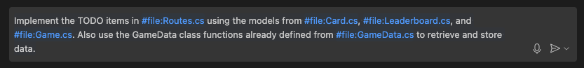
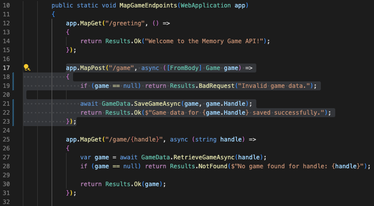

### Description

This lab will highlight importance of proper use of prompt engineering in creating or completing the API(s).

### Goal

- Highlight prompting techniques
- Guide Copilot in generating specific answers
- Using Copilot to handle errors

### Requirements

- Visual Studio Code
- GitHub Copilot Chat

`NOTE` that this lab is language agnostic - using C#.

#### Steps

It's recommended to perform all the commands via GitHub Chat vs. inline code. This allows you to show the original and the suggested code side by side.

#### Step 1: Complete the API Routes TODO Items

- Open the file `Routes/Routes.cs'.
- Open the Copilot Chat and ask Copilot to help.

    `NOTE` that after entering the `#file` text followed by the enter key, VSCode will display the dropdown to allow selection of the file. The file must be blue in the prompt, indicating that Copilot has the file reference. Like this.
    

    ```text
    Implement the TODO items in #file:Routes.cs using the models from #file:Card.cs, #file:Leaderboard.cs, and #file:Game.cs. Also use the GameData class functions already defined from #file:GameData.cs to retrieve and store data.
    ```

    <details>
    <summary>Output</summary>
    <p>

    ```cs
    using Microsoft.AspNetCore.Mvc;
    using api.Models;
    using api.Services;
    using System.Text.Json;

    namespace api.Routes
    {
        public static class GameEndpoints
        {
            public static void MapGameEndpoints(WebApplication app)
            {
                app.MapGet("/greeting", () =>
                {
                    return Results.Ok("Welcome to the Memory Game API!");
                });

                app.MapPost("/game", async ([FromBody] Game game) =>
                {
                    if (game == null) return Results.BadRequest("Invalid game data.");

                    await GameData.SaveGameAsync(game, game.Handle);
                    return Results.Ok($"Game data for {game.Handle} saved successfully.");
                });

                app.MapGet("/game/{handle}", async (string handle) =>
                {
                    var game = await GameData.RetrieveGameAsync(handle);
                    if (game == null) return Results.NotFound($"No game found for handle: {handle}");

                    return Results.Ok(game);
                });

                app.MapPost("/leaderboard", async ([FromBody] Leaderboard entry) =>
                {
                    if (entry == null) return Results.BadRequest("Invalid leaderboard entry.");

                    var leaderboardEntries = await GameData.RetrieveLeaderboardAsync();
                    leaderboardEntries.Add(entry);
                    await GameData.SaveLeaderboardEntryAsync(leaderboardEntries);

                    return Results.Ok($"Leaderboard entry for {entry.Handle} saved successfully.");
                });

                app.MapGet("/leaderboard", async () =>
                {
                    var leaderboardEntries = await GameData.RetrieveLeaderboardAsync();
                    var topTenEntries = leaderboardEntries.OrderByDescending(entry => entry.Score).Take(10);

                    return Results.Ok(topTenEntries);
                });
            }
        }
    }
    ```

</p>
</details>

- In the browser, use Swagger to try the endpoints. The POST endpoints should generate JSON entries in the respective files under the `api/Data` directory.

#### Step 2: Refactor the Game POST API

The `game` POST endpoint uses the "handle" to save the game information, so let's make sure that the handle isn't empty.

- Within the `Routes.cs` file, select the entire `/game` POST function. Like this.
    

- Within Copilot Chat, enter the following:

```text
In #selection, return bad request if the handle is not present.
```

`NOTE` that the `#selection` text should be blue since it is a command.

<details>
<summary>Output</summary>
<p>

```cs
app.MapPost("/game", async ([FromBody] Game game) =>
{
    if (game == null || string.IsNullOrWhiteSpace(game.Handle))
    { return Results.BadRequest("Invalid game data or missing handle."); }

    await GameData.SaveGameAsync(game, game.Handle);
    return Results.Ok($"Game data for {game.Handle} saved successfully.");
});
```

</p>
</details>
